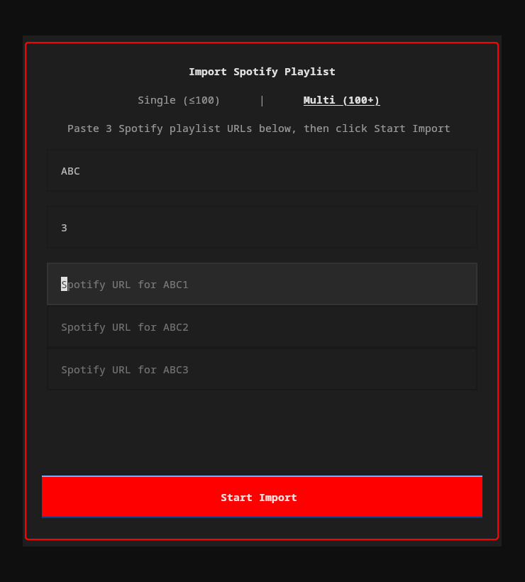

# Spotify Import

Import your Spotify playlists into YouTube Music — from the TUI or CLI.



## How it works

1. **Extract** — Reads track names and artists from the Spotify playlist.
2. **Match** — Searches YouTube Music for each track using fuzzy matching (title 60% + artist 40% weighted score).
3. **Resolve** — Tracks scoring 85%+ are auto-matched. Lower scores prompt you to pick from candidates or skip.
4. **Create** — Creates a new private playlist on your YouTube Music account with all matched tracks.

## Two modes

| Mode | Use case | How |
|------|----------|-----|
| **Single** (≤100 tracks) | Most playlists | Paste one Spotify URL |
| **Multi** (100+ tracks) | Large playlists split across parts | Enter a name + number of parts, paste a URL for each |

## From the TUI

Click **Import** in the footer bar (or press the import button). A popup lets you paste URLs, choose single/multi mode, and watch progress in real time.

## From the CLI

```bash
ytm import "https://open.spotify.com/playlist/37i9dQZF1DXcBWIGoYBM5M"
```

Interactive flow: fetches tracks, shows match results, lets you resolve ambiguous/missing tracks, name the playlist, then creates it.

## Extraction methods

The importer tries two approaches in order:

1. **Spotify Web API** (full pagination, handles any playlist size) — requires a free [Spotify Developer](https://developer.spotify.com/) app. On first use, you'll be prompted for your `client_id` and `client_secret`, which are stored in `~/.config/ytm-player/spotify.json`.
2. **Scraper fallback** (no credentials needed, limited to ~100 tracks) — used automatically if API credentials aren't configured.

For playlists over 100 tracks, set up the API credentials.
